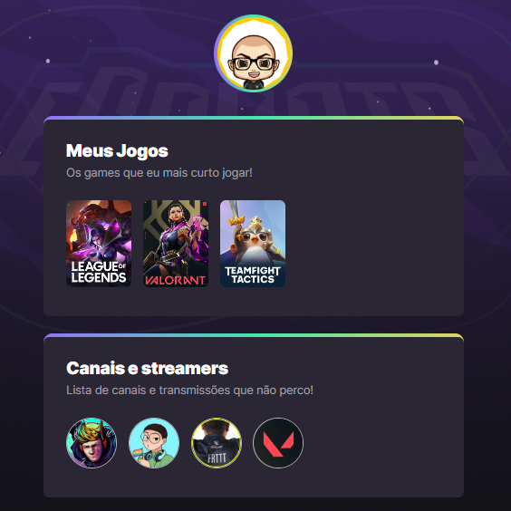

<h1>🎮 LinkTree Gamer</h1>

Projeto similar ao o LinkTree, criado com React.js + Vite, para centralizando links úteis, como Gamers favoritos, Canais e redes sociais.

## 🔗 Project:

Deploy: [Click here to acess](https://projetos-wine.vercel.app/)

## 💻 Tech Stack
 
- CSS
- HTML
- Javascript
- React.js
- Vite
- GIT & Github

## ⭐ Contact

 
  
  
   

